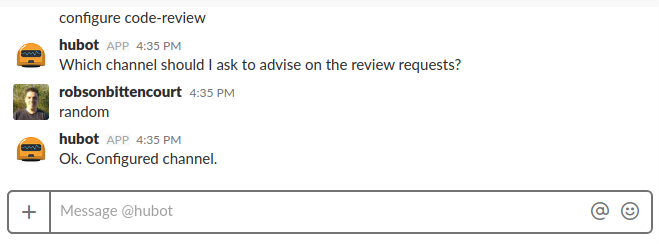
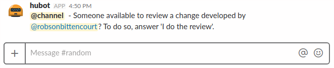
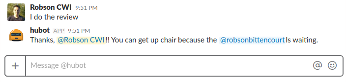
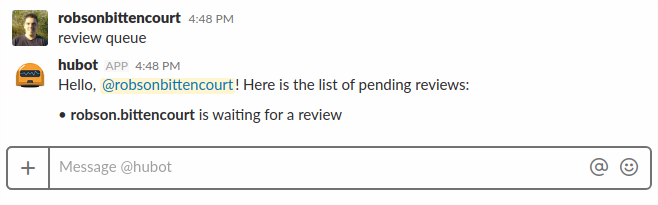
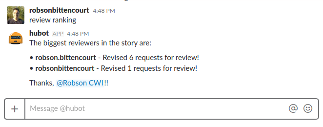

# gear-code-review
A Hubot gear for handle with over the shoulder code reviews

[](https://travis-ci.org/hubot-js/gear-code-review)  [](https://www.npmjs.com/package/gear-code-review) [](https://david-dm.org/hubot-js/gear-code-review)  [](https://david-dm.org/hubot-js/gear-code-review?type=dev)


> A Hubot gear for handle with over the shoulder code reviews

This is a gear to add to hubot.js the ability to ask for reviews. If you do not know the hubot.js or do not know what they are gears like this [click here](https://github.com/hubot-js/hubot.js/blob/master/README.md) for more details.


## Configuration

Some settings are required. They can be made by Slack using the following command:

```
configure code-review
```


These settings are stored, so you just need to do them once. But if necessary can make them again.

## Usage

### Request review

```
code review
```



### Do a review

```
I do the review
```


### Review queue

```
review queue
```



### Review ranking

```
review ranking
```



## Meta
Robson Bittencourt - @rluizv - robson.luizv@gmail.com

Distributed under the MIT license. See [LICENSE](LICENSE) for more information.

https://github.com/hubot-js/gear-code-review
